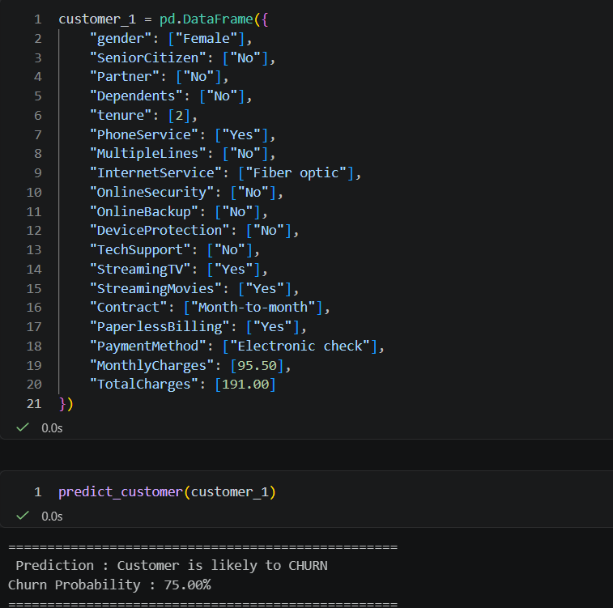
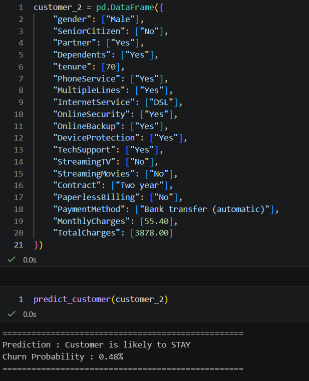
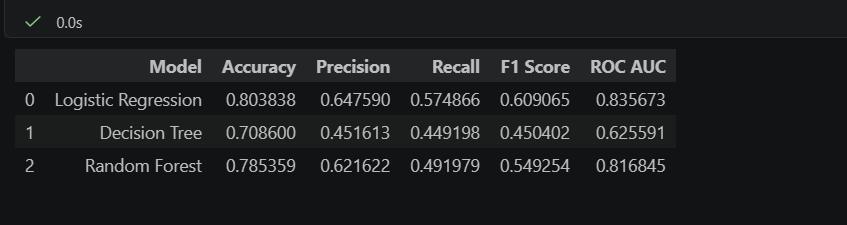
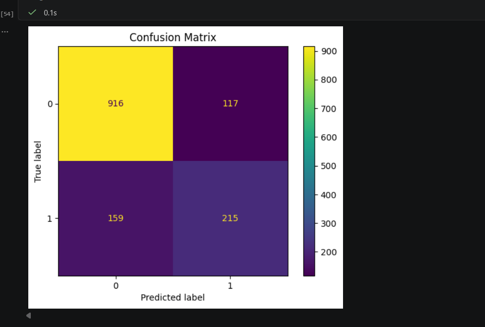
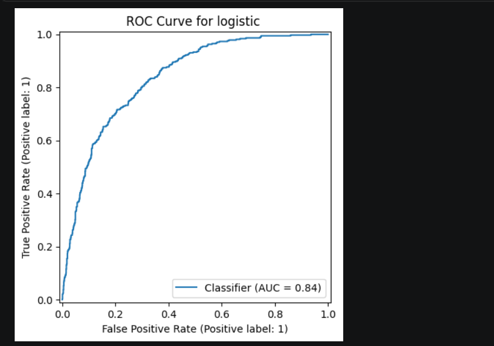

# 📊 Customer Churn Prediction System

An end-to-end Machine Learning project that predicts whether a telecom customer is likely to churn using the IBM Telco Customer Churn dataset.

---

## 📌 Project Overview

Customer churn is one of the biggest challenges for subscription-based businesses. Losing customers directly impacts revenue and growth.

This project builds a Machine Learning model to predict customer churn based on customer demographics, account information, and service usage, enabling businesses to identify high-risk customers and improve retention strategies.

---

## 🎯 Problem Statement

Predict whether a customer will:

- ✅ Stay with the company
- ❌ Churn (Leave the company)

---

## 📂 Dataset

- **Dataset:** IBM Telco Customer Churn
- **Source:** Kaggle / IBM
- **Records:** 7,043 Customers
- **Features:** 21
- **Target Variable:** Churn

---

## 🛠 Technologies Used

- Python
- Pandas
- NumPy
- Matplotlib
- Seaborn
- Scikit-learn
- Joblib
- Jupyter Notebook

---

## 📈 Machine Learning Workflow

- Data Collection
- Data Cleaning
- Exploratory Data Analysis (EDA)
- Feature Engineering
- One-Hot Encoding
- Feature Scaling
- Train-Test Split
- Logistic Regression
- Model Evaluation
- Sample Customer Prediction
- Model Saving

# 📷 Project Screenshots

## sample predictions

---

## Evaluation table

## Confusion Matrix

---

## ROC Curve

---

## 📁 Project Structure

Customer-Churn-Prediction/

├── data/

├── models/

│ ├── churn_model.pkl

│ ├── scaler.pkl

│

├── notebooks/

│ └── churn_prediction.ipynb

├── screenshots/

├── requirements.txt

├── README.md

---

## 🚀 Future Improvements

- Decision Tree Classifier
- Random Forest Classifier
- XGBoost
- Hyperparameter Tuning
- Cross Validation
- Streamlit Web Application
- Docker Deployment

---

## 📚 Key Learnings

Through this project, I gained practical experience in:

- Data Cleaning
- Exploratory Data Analysis
- Feature Engineering
- Classification Algorithms
- Logistic Regression
- Model Evaluation
- ROC Curve Analysis
- Machine Learning Workflow
- Model Deployment Preparation

---

## 👨‍💻 Author

**Prakash Kumar Badaila**

⭐ If you found this project useful, feel free to star the repository.